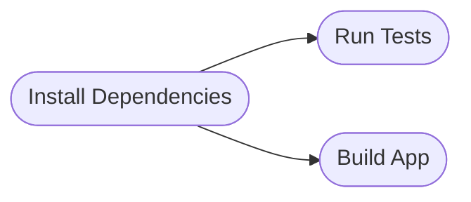

**_This is a multipart series exploring CI/CD optimisations_**

1. [Intro!](./optimising-ci-cd-processes.md)
2. Identifying Common Steps
3. [Caching + Docker (and layer caching)](./optimising-ci-cd-caching.md)
4. [Test Parallelization](./optimising-ci-cd-test-parallelization.md)
5. [Hopper Configuration Upgrade (Deliveroo-specific)](./optimising-ci-cd-hopper-upgrades.md)

## Let's get on the same page!

A few things before we get started (I know you may have already read this. If so, skip this section).

First, I'm going to talk very specifically here about JS/TS projects, but these ideas can be applied to all CI/CD
processes.

Second, I'm going to use [CircleCI](https://circleci.com/) as the CI/CD platform when talking through examples. These
concepts can likely apply to other CI/CD platforms.

Lastly, let's define some terms, so we're all on the same page:

-   **Step**: A step is a single unit of work in a CI/CD process
    -   For example, installing dependencies, setting up environment variables, initiating commands, etc.
-   **Job**: A collection of steps
    -   For example, running tests, linting code, building a Docker image, etc.
-   **Build Pipeline**: A collection of _jobs_ that represents all work

## Identifying Common Steps

Are there any steps that are common across multiple jobs? If so, we can extract them into a single job, which can then
be used by other jobs.

Let's use an example. We have two jobs, test and build. Both of these jobs require the same dependencies to be installed.
It's likely that these jobs both have an "install dependencies" step (illustrated below).

This can be extracted to its own job, where dependencies are installed, saved as an artifact, and then used by the other
jobs. Jobs can benefit from this even if the output from the job isn't needed right away.

This helps us not waste time, and likely money, doing the exact same thing twice.

Be sure to have a look at the other posts in this series about optimising CI/CD processes!
