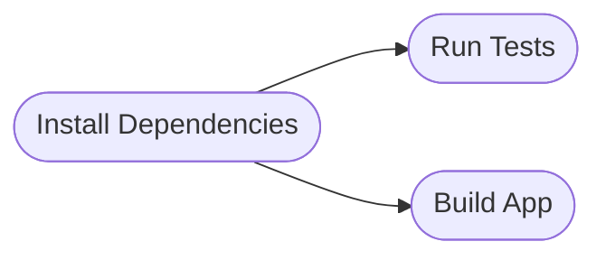

_I'll be talking about some Deliveroo-specific things in this post. When I do, I'll be sure to provide as much context as possible._

I recently moved to a new team at Deliveroo. To get up to speed faster, I started contributing as much as possible to
one of primary codebases used in the area. Getting down and dirty is the best form of learning, right?

Right off the bat, I noticed that there were extremely long feedback loops when implementing changes. In order to release
a change to production, we have to do the following:

1. Develop and test change locally
2. Run the CI/CD process (most of it) against the feature branch _(~17 minutes)_
3. Deployed to the staging environment
    - CI/CD _(~23 minutes)_
    - Deployment _(~6 minutes)_
4. Test in staging
5. Deployed to the production environment
    - CI/CD _(~23 minutes)_
    - Deployment _(~6 minutes)_
6. Test in production

I've put the durations of each step (p95) above. If we exclude initial development and testing, if everything went
perfectly (does it ever?!), it would take a minimum of ~75 minutes.

DAMNNNNN, that's a long time, huh?!?!

But, does the time it takes to get things to production really matter? Well, yes, but is it the right thing we should
be measuring (outside of incidents)?

I would say no. IMO (which is opinionated), we should be measuring the time it takes a team to deliver value to customers.
Or, to put it in a more simple way, how long does it take to get a change to production, from the moment work begins to
the moment customer start using it?

For those of you following along, you may know where I'm going next.

Mean [Lead Time for Changes](https://cloud.google.com/blog/products/devops-sre/using-the-four-keys-to-measure-your-devops-performance),
a [DORA](https://dora.dev/) metric, is a great metric to track, and the one I'm going to focus on in this post. Disagree
with me in the comments (or don't, up to you).

At Deliveroo, our deployment system, Hopper, tracks this automagically for us, which is amazing.

Before I started the work I describe in this post, we had quite a large Daily Median Lead Time to Change (can't really
say the actual number...). After these optimisations were implemented, we saw around a 50% reduction.

Now, I'm not saying that all of that reduction is attributed to these optimisations, but I know they helped, both from
my personal experiences and my team's.

Let's get into it!

## Optimisations

A few things before we get started.

First, I'm going to talk very specifically here about JS/TS projects, but these ideas can be applied to all CI/CD
processes.

Second, I'm going to use [CircleCI](https://circleci.com/) as the CI/CD platform when talking through examples. These
concepts can likely apply to other CI/CD platforms.

Lastly, let's define some terms, so we're all on the same page:

-   **Step**: A step is a single unit of work in a CI/CD process
    -   For example, installing dependencies, setting up environment variables, initiating commands, etc.
-   **Job**: A collection of steps
    -   For example, running tests, linting code, building a Docker image, etc.
-   **Build Pipeline**: A collection of _jobs_ that represents all work

### Identifying Common Steps

Are there any steps that are common across multiple jobs? If so, we can extract them into a single job, which can then
be used by other jobs.

Let's use an example. We have two jobs, test and build. Both of these jobs require the same dependencies to be installed.
It's likely that these jobs both have an "install dependencies" step (illustrated below).


This can be extracted to its own job, where dependencies are installed, saved as an artifact, and then used by the other
jobs. Jobs can benefit from this even if the output from the job isn't needed right away.



This helps us not waste time, and likely money, doing the exact same thing twice.

### Caching

There may be certain things that will be done every time the build pipeline is executed (i.e. when code changes are pushed).

We should try our best to reuse output from previous build pipelines to speed up our build. In other words, we should
cache parts of our build pipeline for later!

Some common examples in the frontend world include node modules and Next.js' build output (likely loads more).

In CircleCI, you can use a configuration, like below, to save and restore cached assets ([docs](https://circleci.com/docs/caching/#basic-example-of-dependency-caching)).

```yaml
- restore_cache:
      name: Restore Next cache
      keys:
          # To force update the next cache, simply bump the value of the NEXTJS_CACHE_VERSION in CircleCI and re-run your build
          - nextjs-cache-v1.0-{{ .Environment.NEXTJS_CACHE_VERSION }}-{{ checksum "package-lock.json" }}-{{ checksum ".nvmrc" }}
- save_cache:
      name: Save Next cache
      # To force update the next cache, simply bump the value of the NEXTJS_CACHE_VERSION in CircleCI and re-run your build
      key: nextjs-cache-v1.0-{{ .Environment.NEXTJS_CACHE_VERSION }}-{{ checksum "package-lock.json" }}-{{ checksum ".nvmrc" }}
      paths:
          - ./.next/cache
```

Now, the most important part in the configuration above is the `key` value. This will help CircleCI determine if it can
reuse the cache or not.

As you can see, I use dynamic values, such as:

1. `{{ checksum "package-lock.json" }}` - Don't use the cache if dependencies have changed
2. `{{ checksum ".nvmrc" }}` - Don't use the cache if the Node.js version has changed
3. `{{ .Environment.NEXTJS_CACHE_VERSION }}` - Don't use the cache if the CircleCI environment variable has been updated
    - This is really helpful if you want to cache bust without releasing code.

If the `key` is the same between build pipelines, then the cache will be loaded and reused, speeding up builds.

We do this for node modules using the [`circleci/node` orb](https://circleci.com/developer/orbs/orb/circleci/node), with
a configuration along the lines of:

```yaml
install_deps: &install_deps
    steps:
        - checkout
        - node/install-packages:
              cache-version: node-modules-cache-v1.0-{{ .Environment.NODE_MODULES_CACHE_VERSION }}-{{ checksum "package-lock.json" }}-{{ checksum ".nvmrc" }}
              cache-path: ~/project/node_modules
              override-ci-command: "[ ! -d node_modules ] && npm ci --no-fund --no-audit || echo 'Using cached node_modules directory'"
              include-branch-in-cache-key: false
        - persist_to_workspace:
              root: .
              paths:
                  - node_modules
```

This reduced the installation time of node modules from ~4-5 minute to ~2 minutes consistently. When the cache needs to
be regenerated (i.e. new dependencies are installed, Node.js version updated, etc.), it will take more time. But, after
the first time this is done, we go back to ~2 minutes.

Jobs that depend on this cache can then attach the workspace. Then, they don't need to install dependencies themselves!

### Docker (and layer caching)

CircleCI provides a paid feature called [Docker Layer Caching](https://circleci.com/docs/docker-layer-caching/).

Essentially, if you're using their [remote Docker environment](https://circleci.com/docs/building-docker-images/) to
build your Docker images, you can have benefits local layer caching in a remote environment.

For example, when building an image locally for the first time all the necessary steps are executed (i.e. fresh "install").
When you build it the second time, Docker is smart enough to understand things that have and haven't changed between builds.
It will then only execute the necessary steps and used cached outputs from previous builds.

This is what you get in CircleCI.

It's also important to understand how Docker layer caching works (at a fundamental level). Let's use the two configurations
below as examples.

**Config 1**

```dockerfile
FROM node:20.9.0-alpine
ENV NODE_ENV=production

# Copy the built app
COPY . .

# Only install production dependencies
RUN npm ci --omit=dev --ignore-scripts

# Start app
CMD npm start
```

**Config 2**

```dockerfile
FROM node:20.9.0-alpine
ENV NODE_ENV=production

# Only install production dependencies
COPY package.json package-lock.json ./
RUN npm ci --omit=dev --ignore-scripts

# Copy the built app
COPY . .

# Start app
CMD npm start
```

**Config 1** uses a base Node.js image and:

1. Copies the application code
2. Installs the necessary dependencies
3. Creates the start command

**Config 2** uses a base Node.js image, and:

1. Copies the `package.json` (and lockfile)
2. Installs the necessary dependencies
3. Copies the application code
4. Creates the start command

How does the slight differences in these configurations affect the outcome??

Thought about it?!?

Assuming you build a Docker image whenever application code changes, **Config 1** will never use layer caching when
installing dependencies. **Config 2** will use layer caching (if you've not added any new dependencies).

Why?!?!

Since **Config 1** copies the application code before dependencies are installed, this means the only way the layer
executing `npm ci` could be cached is if nothing in the application code changed. Since you build a Docker image when
application code changes, this will never happen.

Since **Config 2** installs dependencies prior to copying the application code, Docker will be able to cache this layer.
If new dependencies are installed, it will not use a cache layer, but rather run the command and output a cache for
the next build.

Pretty cool right?!!?

### Test Parallelization

Running tests is one of the things that takes a fair amount of time. It really depends on how many tests you have, where
and how they are executed, and what they are executed by.

So, when you can't update to things like [vitest](https://vitest.dev/) (which is fast, but won't solve all your problems)
we can try to execute tests in parallel.

#### Jest

[Jest](https://jestjs.io/) is used quite a lot, and it's rare that you find anything else in established companies (maybe
Mocha if you're lucky 😉).

Jest, by default (correct me if I'm wrong), runs tests in parallel in single run mode:

> In single run mode, this defaults to the number of the cores available on your machine minus one for the main thread.

When watching for changes, it's slightly different:

> ...this defaults to half of the available cores on your machine to ensure Jest is unobtrusive and does not grind your
> machine to a halt.

And they even recommend to use a value of 50% when setting the max worker threads in environments where CPU cores vary
(i.e. CI/CD platforms)

> For environments with variable CPUs available, you can use percentage based configuration: --maxWorkers=50%

Cool, that's out the of way... But, this can only get you so far.

Jest also provides you the ability to shard your tests across different build agents using the [`--shard` flag](https://jestjs.io/docs/cli#--shard).

CircleCI allows for easy integration, only having to add a `parallelism: XXX` configuration option to your job. You can
then update your testing step to be something along the lines of:

```sh
# npm test="jest"
npm run test -- --shard=$(expr $CIRCLE_NODE_INDEX + 1)/$CIRCLE_NODE_TOTAL
```

This will divide the tests into the amount of sections you've defined in the `parallelism:` option and execute them
across the agents.

To make the extremely clear, let's use the following example. I've set up my CircleCI job with a `parallelism: 3`. I have
a test suite with 900 tests. CircleCI will then run 300 tests across each build agent in parallel.

You can see how this could cut execution time down!

#### Cypress

### Hopper Configuration Upgrade

Hopper is the deployment software we use at Deliveroo. It deploys our services and Lambdas to AWS.

The team responsible for Hopper recently released a v2 Configuration. The service in question was not using this new
configuration.

After upgrading to v2, we saw our deployments go from between 6-11 minutes to less than 5 minutes consistently.

Lesson here?! It always pays to stay up to date.

## Wrapping It Up

Should be encouraging as much local testing as possible
CI/CD costs should be taken into account (using bigger instances only cut down so much time, but increase costs)

1. intro (deliveroo specific, but will translate)
2. optimisations 3. common, shared steps 4. caching (workspaces) 5. node modules 6. next build 7. docker + docker layer caching 8. parallelisation (jest + cirlce utils to split) 9. Hopper (deliveroo)
3. conclusion (local testing, removing faff, etc.)
